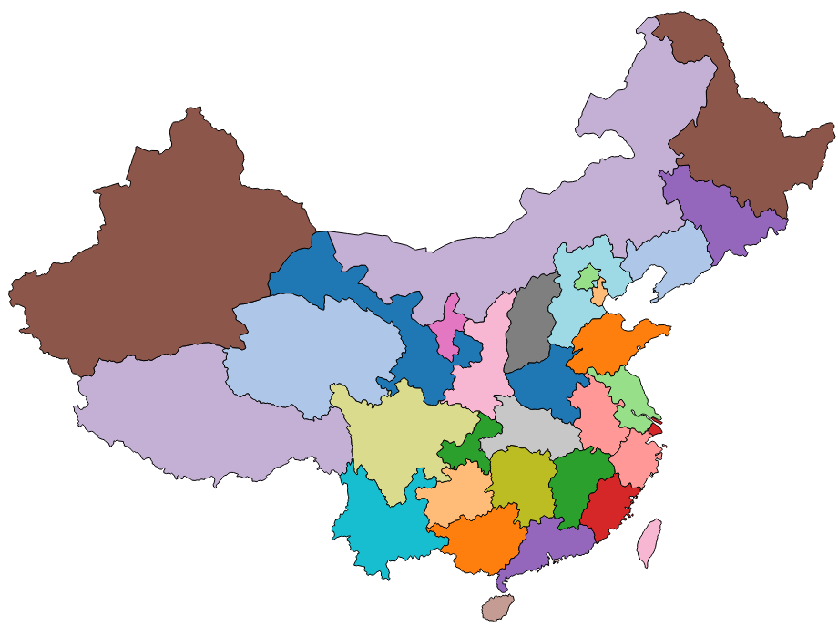

# 第十六章 中国地图

本章以中国地图为例，介绍地图的制作方法。

在数据可视化中，地图是很重要的一部分。很多情况会与地图有关联，如中国各省的人口多少，GDP多少等，都可以和地图联系在一起。

## 地图数据的获取

制作地图需要 JSON 文件。JSON(JavaScript Object Notation) 是一种轻量级的数据交换格式。关于 JSON 的语法格式，可以学习【[JSON 浅谈](http://www.ourd3js.com/wordpress/?cat=309)】系列。

将 JSON 的格式应用于地理上的文件，叫做 GeoJSON 文件。本文就是用这种文件绘制地图。

那么如何获取中国地图的 GeoJSON 文件呢，真的有点麻烦，可以参照：[https://github.com/clemsos/d3-china-map](https://github.com/clemsos/d3-china-map)进行制作。这不仅需要安装一些东西，还要研究一下制作方法，对想直接下载获取中国地图的 GeoJSON 文件的朋友可能感觉很不舒服，呵呵，其实我也是这样。

好吧，我辛苦一点，将制作好的中国地图放上来与大家分享。

中国地图的 GeoJSON 文件： [china.geojson](http://www.ourd3js.com/demo/rm/R-10.0/china.geojson)

这个文件是用 [Natural Earth](http://www.naturalearthdata.com/downloads/) 上的数据，经过提取后制作而成，我还去掉了很多无用的信息，只保留的中国的各省份的名字和 id 号，在这里先感谢 Natural Earth 提供的数据。

本站还提供有其他国家、以及具体到中国县级的地理文件，希望为大家节省宝贵的时间，这个部分还是很麻烦的。对于只希望进行可视化的朋友来说，估计不想做这个工作。目前已经制作好的：

- [世界地图和主要国家](http://www.ourd3js.com/wordpress/?p=668)
- [中国省市级](http://www.ourd3js.com/wordpress/?p=638)
- [中国县级](http://www.ourd3js.com/wordpress/?p=739)

好了，开始绘制地图吧。

## 投影函数

```javascript
var projection = d3.geo.mercator()
    .center([107, 31])
    .scale(850)
    .translate([width/2, height/2]);
```

由于 GeoJSON 文件中的地图数据，都是经度和纬度的信息。它们都是三维的，而要在网页上显示的是二维的，所以要设定一个投影函数来转换经度纬度。如上所示，使用 d3.geo.mercator() 的投影方式。各种投影的函数，可以参考： [https://github.com/mbostock/d3/wiki/Geo-Projections](https://github.com/mbostock/d3/wiki/Geo-Projections)

第 2 行：center() 设定地图的中心位置，[107,31] 指的是经度和纬度。

第 3 行：scale() 设定放大的比例。

第 4 行：translate() 设定平移。

## 地理路径生成器

为了根据地图的地理数据生成 SVG 中 path 元素的路径值，需要用到 d3.geo.path()，我称它为地理路径生成器。

```javascript
var path = d3.geo.path()
    .projection(projection);
```

projection() 是设定生成器的投影函数，把上面定义的投影传入即可。以后，当使用此生成器计算路径时，会自己加入投影的影响。

## 向服务器请求文件并绘制地图

```javascript
d3.json("china.json", function(error, root) {
        
    if (error) 
        return console.error(error);
    console.log(root.features);
        
    svg.selectAll("path")
        .data( root.features )
        .enter()
        .append("path")
        .attr("stroke","#000")
        .attr("stroke-width",1)
        .attr("fill", function(d,i){
            return color(i);
        })
        .attr("d", path )   //使用地理路径生成器
        .on("mouseover",function(d,i){
                    d3.select(this)
                       .attr("fill","yellow");
                })
                .on("mouseout",function(d,i){
                    d3.select(this)
                       .attr("fill",color(i));
                });
});
```

再次声明：d3.json() 不能直接读取本地文件，因此你需要搭建一个服务器，例如 Apache。

接下来，就是给 svg 中添加 path 元素。本例中，每一个 path 表示一个省。要注意 attr(“d”,path) 这一行代码，它相当于：

```javascript
.attr("d",funtion(d){
    return path(d);
})
```

这种省略用法是很常用的，请务必掌握。

好了，看结果吧：



## 源代码

下载地址：[rm100.zip](http://www.ourd3js.com/src/rm/rm100.zip)

展示地址：[http://www.ourd3js.com/demo/rm/R-10.0/chinamap.html](http://www.ourd3js.com/demo/rm/R-10.0/chinamap.html)

注意，由于需要读取地图的数据文件，显示可能会有延迟。
