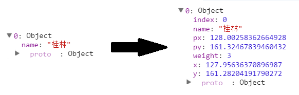

# 第十四章 力导向图

力导向图（Force-Directed Graph），是绘图的一种算法。在二维或三维空间里配置节点，节点之间用线连接，称为连线。各连线的长度几乎相等，且尽可能不相交。节点和连线都被施加了力的作用，力是根据节点和连线的相对位置计算的。根据力的作用，来计算节点和连线的运动轨迹，并不断降低它们的能量，最终达到一种能量很低的安定状态。


力导向图能表示节点之间的多对多的关系。

## 数据

初始数据如下：

```javascript
var nodes = [ { name: "桂林" }, { name: "广州" },
              { name: "厦门" }, { name: "杭州" },
              { name: "上海" }, { name: "青岛" },
              { name: "天津" } ];
 
 var edges = [ { source : 0 , target: 1 } , { source : 0 , target: 2 } ,
               { source : 0 , target: 3 } , { source : 1 , target: 4 } ,
               { source : 1 , target: 5 } , { source : 1 , target: 6 } ];
```

节点（nodes）和连线（edges）的数组，节点是一些城市名，连线的两端是节点的序号（序号从 0 开始）。

这些数据是不能作图的，因为不知道节点和连线的坐标。这句话一说出来，就请想到布局。本章用到的布局是：**d3.layout.force()**。

## 布局（数据转换）

定义一个力导向图的布局如下。

```javascript
var force = d3.layout.force()
      .nodes(nodes) //指定节点数组
      .links(edges) //指定连线数组
      .size([width,height]) //指定作用域范围
      .linkDistance(150) //指定连线长度
      .charge([-400]); //相互之间的作用力
```

然后，使力学作用生效：

```javascript
force.start();    //开始作用
```

如此，数组 nodes 和 edges 的数据都发生了变化。在控制台输出一下，看看发生了什么变化。

```javascript
console.log(nodes);
console.log(edges);
```

节点转换前后如下图。



转换后，节点对象里多了一些变量。其意义如下：

- index：节点的索引号
- px, py：节点上一个时刻的坐标
- x, y：节点的当前坐标
- weight：节点的权重

再来看看连线的变化。


可以看到，连线的两个节点序号，分别变成了对应的节点对象。

## 绘制

有了转换后的数据，就可以作图了。分别绘制三种图形元素：

- line，线段，表示连线。
- circle，圆，表示节点。
- text，文字，描述节点。

代码如下：

```javascript
//添加连线 
 var svg_edges = svg.selectAll("line")
     .data(edges)
     .enter()
     .append("line")
     .style("stroke","#ccc")
     .style("stroke-width",1);
 
 var color = d3.scale.category20();
 
 //添加节点 
 var svg_nodes = svg.selectAll("circle")
     .data(nodes)
     .enter()
     .append("circle")
     .attr("r",20)
     .style("fill",function(d,i){
         return color(i);
     })
     .call(force.drag);  //使得节点能够拖动

 //添加描述节点的文字
 var svg_texts = svg.selectAll("text")
     .data(nodes)
     .enter()
     .append("text")
     .style("fill", "black")
     .attr("dx", 20)
     .attr("dy", 8)
     .text(function(d){
        return d.name;
     });
```

调用 call( force.drag ) 后节点可被拖动。force.drag() 是一个函数，将其作为 call() 的参数，相当于将当前选择的元素传到 force.drag() 函数中。

最后，还有一段最重要的代码。由于力导向图是不断运动的，每一时刻都在发生更新，因此，必须不断更新节点和连线的位置。

力导向图布局 force 有一个事件 tick，每进行到一个时刻，都要调用它，更新的内容就写在它的监听器里就好。

```javascript
force.on("tick", function(){ //对于每一个时间间隔
    //更新连线坐标
    svg_edges.attr("x1",function(d){ return d.source.x; })
        .attr("y1",function(d){ return d.source.y; })
        .attr("x2",function(d){ return d.target.x; })
        .attr("y2",function(d){ return d.target.y; });
 
    //更新节点坐标
    svg_nodes.attr("cx",function(d){ return d.x; })
        .attr("cy",function(d){ return d.y; });

    //更新文字坐标
    svg_texts.attr("x", function(d){ return d.x; })
       .attr("y", function(d){ return d.y; });
 });
```

tick 的英文意思是钟表发出的嘀嗒嘀嗒声，想到这个大家应该很清楚了吧。每次触发时，都会调用后面的无名函数 function。


## 源代码

下载地址：[rm80.zip](http://www.ourd3js.com/src/rm/rm92.zip)

展示地址：[http://www.ourd3js.com/demo/rm/R-9.2/force.html](http://www.ourd3js.com/demo/rm/R-9.2/force.html)
