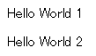
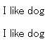

# 第二章 第一个程序 HelloWorld

先尝试用 D3 写第一个 HelloWorld 程序。学编程入门的第一个程序都是在屏幕上输出 HelloWorld，本课稍微有些不同，不是单纯的输出。

## HTML 是怎么输出 HelloWorld 的

都知道 HTML 吧，如果不知道请下百度一下吧。在 HTML 中输出 HelloWorld 是怎样的呢，先看下面的代码。

```html
<html> 
  <head> 
        <meta charset="utf-8"> 
        <title>HelloWorld</title> 
  </head> 
    <body> 
        <p>Hello World 1</p>
        <p>Hello World 2</p>
    </body> 
</html>
```

如果你学习过 HTML，应该知道会在浏览器中输出两行文字，如下图：



## 用 JavaScript 来更改 HelloWorld

对于上面输出的内容，如果想用 JavaScript 来更改这两行文字，怎么办呢？我们会添加代码变为：

```html
<html> 
  <head> 
        <meta charset="utf-8"> 
        <title>HelloWorld</title> 
  </head> 
    <body> 
    <p>Hello World 1</p>
    <p>Hello World 2</p>
        <script>
        var paragraphs = document.getElementsByTagName("p");
        for (var i = 0; i < paragraphs.length; i++) {
          var paragraph = paragraphs.item(i);
          paragraph.innerHTML = "I like dog.";
        }          
        </script> 
    </body> 
</html>
```

结果变为：



可以看到，使用 JavaScript，我们添加了4行代码。

## 用 D3 来更改 HelloWorld

如果使用 D3.js 来修改这两行呢？只需添加一行代码即可。注意不要忘了引用 D3.js 源文件。

```html
<html> 
  <head> 
        <meta charset="utf-8"> 
        <title>HelloWorld</title> 
  </head> 
    <body> 
        <p>Hello World 1</p>
        <p>Hello World 2</p>
        <script src="http://d3js.org/d3.v3.min.js" charset="utf-8"></script> 
        <script>  
        d3.select("body").selectAll("p").text("www.ourd3js.com");      
        </script> 
    </body> 
</html>
```

结果会变为：


也实现同样的功能，但是却显得十分简洁。不错，其实 D3.js 中的所有功能在 JavaScript 中都能实现，它仅仅是一个函数库而已。D3 所做的事就是减轻你的工作量，以及使你的代码十分简单易懂。

接下来改变字体的颜色和大小，稍微修改上述代码：

```html
//选择<body>中所有的<p>，其文本内容为 www.ourd3js.com，选择集保存在变量 p 中
var p = d3.select("body")
          .selectAll("p")
          .text("www.ourd3js.com");

//修改段落的颜色和字体大小
p.style("color","red")
 .style("font-size","72px");
 ```

上面的代码是先将选中的元素赋值给变量 p，然后通过变量 p 来改变样式，这样可以使代码更整洁。

这里涉及一个概念：**选择集**

使用 d3.select() 或 d3.selectAll() 选择元素后返回的对象，就是**选择集**。

另外，有人会发现，D3 能够连续不断地调用函数，形如：

d3.select().selectAll().text()

这称为**链式语法**，和 JQuery 的语法很像，常用 JQuery 的朋友一定会感到很亲切。