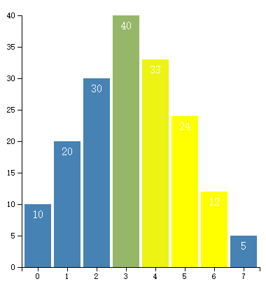

# 第十一章 交互式操作

与图表的交互，指在图形元素上设置一个或多个监听器，当事件发生时，做出相应的反应。



## 什么是交互

交互，指的是用户输入了某种指令，程序接受到指令之后必须做出某种响应。对可视化图表来说，交互能使图表更加生动，能表现更多内容。例如，拖动图表中某些图形、鼠标滑到图形上出现提示框、用触屏放大或缩小图形等等。

用户用于交互的工具一般有三种：鼠标、键盘、触屏。

## 如何添加交互

对某一元素添加交互操作十分简单，代码如下：

```javascript
var circle = svg.append("circle");
 
circle.on("click", function(){
    //在这里添加交互内容
});
```

这段代码在 SVG 中添加了一个圆，然后添加了一个监听器，是通过 on() 添加的。在 D3 中，每一个选择集都有 on() 函数，用于添加事件监听器。

on() 的第一个参数是监听的事件，第二个参数是监听到事件后响应的内容，第二个参数是一个函数。

鼠标常用的事件有：

- click：鼠标单击某元素时，相当于 mousedown 和 mouseup 组合在一起。
- mouseover：光标放在某元素上。
- mouseout：光标从某元素上移出来时。
- mousemove：鼠标被移动的时候。
- mousedown：鼠标按钮被按下。
- mouseup：鼠标按钮被松开。
- dblclick：鼠标双击。

键盘常用的事件有三个：

- keydown：当用户按下任意键时触发，按住不放会重复触发此事件。该事件不会区分字母的大小写，例如“A”和“a”被视为一致。
- keypress：当用户按下字符键（大小写字母、数字、加号、等号、回车等）时触发，按住不放会重复触发此事件。该事件区分字母的大小写。
- keyup：当用户释放键时触发，不区分字母的大小写。
触屏常用的事件有三个：

- touchstart：当触摸点被放在触摸屏上时。
- touchmove：当触摸点在触摸屏上移动时。
- touchend：当触摸点从触摸屏上拿开时。
当某个事件被监听到时，D3 会把当前的事件存到 d3.event 对象，里面保存了当前事件的各种参数，请大家好好参详。如果需要监听到事件后立刻输出该事件，可以添加一行代码：

```javascript
circle.on("click", function(){
    console.log(d3.event);
});
```

## 带有交互的柱形图

将第 5.1 章的部分代码修改成如下代码。

```javascript
var rects = svg.selectAll(".MyRect")
        .data(dataset)
        .enter()
        .append("rect")
        .attr("class","MyRect")   //把类里的 fill 属性清空
        .attr("transform","translate(" + padding.left + "," + padding.top + ")")
        .attr("x", function(d,i){
            return xScale(i) + rectPadding/2;
        } )
        .attr("y",function(d){
            return yScale(d);
        })
        .attr("width", xScale.rangeBand() - rectPadding )
        .attr("height", function(d){
            return height - padding.top - padding.bottom - yScale(d);
        })
        .attr("fill","steelblue")       //填充颜色不要写在CSS里
        .on("mouseover",function(d,i){
            d3.select(this)
                .attr("fill","yellow");
        })
        .on("mouseout",function(d,i){
            d3.select(this)
                .transition()
                .duration(500)
                .attr("fill","steelblue");
        });
```

这段代码添加了鼠标移入（mouseover），鼠标移出（mouseout）两个事件的监听器。监听器函数中都使用了 d3.select(this)，表示选择当前的元素，this 是当前的元素，要改变响应事件的元素时这么写就好。

mouseover 监听器函数的内容为：将当前元素变为黄色

mouseout 监听器函数的内容为：缓慢地将元素变为原来的颜色（蓝色）


## 源代码

下载地址：[rm80.zip](http://www.ourd3js.com/src/rm/rm80.zip)

展示地址：[http://www.ourd3js.com/demo/rm/R-8.0/interaction.html](http://www.ourd3js.com/demo/rm/R-8.0/interaction.html)
