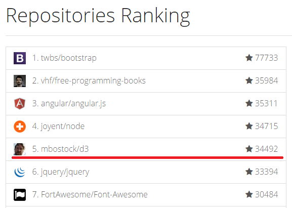

# 第一章 简介和安装

近年来，可视化越来越流行，许多报刊杂志、门户网站、新闻、媒体都大量使用可视化技术，使得复杂的数据和文字变得十分容易理解，有一句谚语“一张图片价值于一千个字”，的确是名副其实。各种数据可视化工具也如井喷式地发展，D3 正是其中的佼佼者。

## D3 是什么

D3 的全称是（Data-Driven Documents），顾名思义可以知道是一个被数据驱动的文档。听名字有点抽象，说简单一点，其实就是一个 JavaScript 的函数库，使用它主要是用来做数据可视化的。如果你不知道什么是 JavaScript ，请先学习一点 JavaScript 的基础知识。

[W3School 的 JavaScript 教程](http://www.w3school.com.cn/js/)

JavaScript 文件的后缀名通常为 .js，故 D3 也常使用 D3.js 称呼。D3 提供了各种简单易用的函数，大大简化了 JavaScript 操作数据的难度。由于它本质上是 JavaScript ，所以用 JavaScript 也是可以实现所有功能的，但它能大大减小你的工作量，尤其是在数据可视化方面，D3 已经将生成可视化的复杂步骤精简到了几个简单的函数，你只需要输入几个简单的数据，就能够转换为各种绚丽的图形。有过 JavaScript 基础的朋友一定很容易理解它。

## 为什么要数据可视化

现在有一组数据， 【  4 ， 32 ， 15 ， 16 ， 42 ， 25   】 ，你能一眼看出它们的大小关系吗？当然这里的数据不算多，有那眼疾手快的家伙站出来说我能一眼看出来！但更直观的是用图形显示，如下图：


通过图形的显示，能很清楚地知道他们的大小关系。当然，D3 能力远不止如此，这只是一个很小的应用。把枯燥乏味复杂的数据，用简单明了的图形表示出来，这就是**数据可视化**。

## D3 有多受欢迎

D3 是一个开源项目，作者是纽约时报的工程师。D3 项目的代码托管于 GitHub（一个开发管理平台，目前已经是全世界最流行的代码托管平台，云集了来自世界各地的优秀工程师）。



在 GitHub 上最受关注的项目有哪些呢？

JQuery 的名声够大了，但排名第 6，D3 却排名第 5。

## 如何学习和使用 D3

以下是几个学习 D3 的站点：
 
 - 官方网站

[http://d3js.org/](http://d3js.org/)  

包含有很多示例和 API，要想得心应手的使用 D3，熟悉 API 是避不开的。
 
- Mike Bostock 的博客和作品展示板

[http://bost.ocks.org/mike/](http://bost.ocks.org/mike/) 

 - OUR D3.JS 数据可视化专题站

[http://www.ourd3js.com/](http://www.ourd3js.com/)

笔者开设的站点，包含有 D3 的一系列教程。

D3 是一个 JavaScript 函数库，并不需要通常所说的“安装”。它只有一个文件，在 HTML 中引用即可。有两种方法：

**（1）下载 D3.js 的文件**

- [d3.zip](https://github.com/mbostock/d3/releases/download/v3.4.8/d3.zip)

解压后，在 HTML 文件中包含相关的 js 文件即可。

**（2）直接包含网络的链接**

```javascript
<script src="http://d3js.org/d3.v3.min.js" charset="utf-8"></script>
```

这种方法比较简单，但要保持网络连接有效。

## 学习 D3 需要什么预备知识

想要通过 D3 来开启数据可视化之旅的朋友，需要什么预备知识呢？

- HTML：超文本标记语言，用于设定网页的内容
- CSS：层叠样式表，用于设定网页的样式
- JavaScript：一种直译式脚本语言，用于设定网页的行为
- DOM：文档对象模型，用于修改文档的内容和结构
- SVG：可缩放矢量图形，用于绘制可视化的图形

路人甲：额，我需要学那么多才能开始学 D3 吗？心理压力有点点...大

馒头华华：不必，完全可以直接学 D3，遇到不明白的地方，再看相关内容即可

路人乙：HTML、CSS 啥的，我从来都没用过，也没有关系吗？

馒头华华：只要在 W3School ，分别看看这几个词是什么意思，是用来干什么的，再看几个简单例子即可，没有必要全掌握了再学习 D3。

## 需要什么工具

制作网页常用的工具即可。

记事本软件：Notepad++、Editplus、Sublime Text 等，选择自己喜欢的即可。

浏览器：IE9 以上、Firefox、Chrome 等，推荐用 Chrome

服务器软件：Apache、Tomcat 等

其中，服务器软件可能不是必须的，不过 D3 中有些函数需要将 HTML 文件放置于服务器目录下，才能正常使用，关于这点以后会再做说明。


好了，可以开始你的 D3 之旅了。祝你好运。