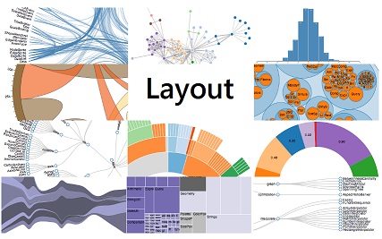
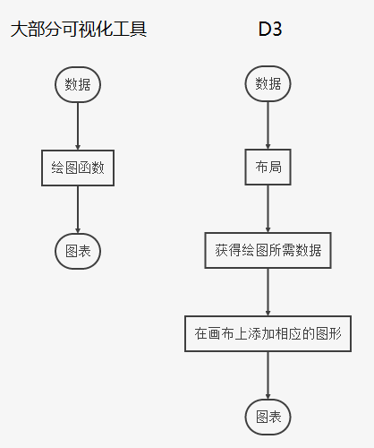
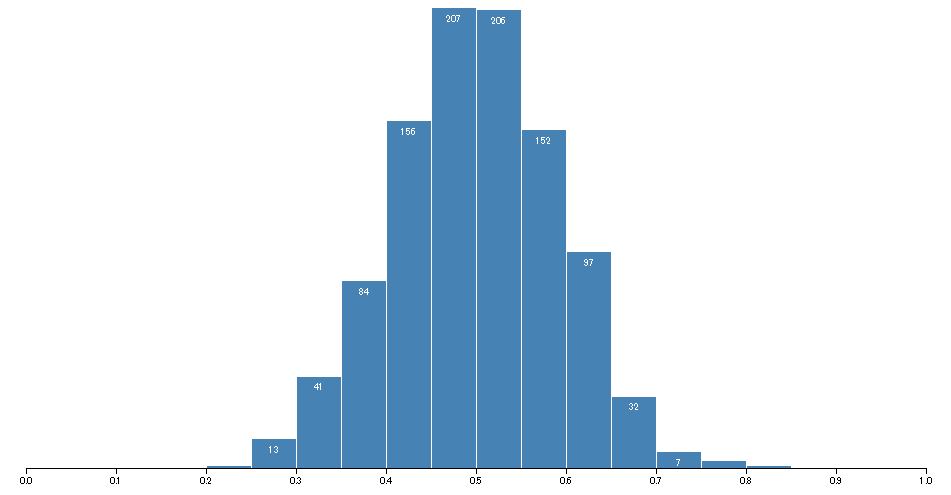

# 第十二章 布局

布局，可以理解成 “制作常见图形的函数”，有了它制作各种相对复杂的图表就方便多了。

## 布局是什么

布局，英文是 Layout。从字面看，可以想到有“决定什么元素绘制在哪里”的意思。布局是 D3 中一个十分重要的概念。D3 与其它很多可视化工具不同，相对来说较底层，对初学者来说不太方便，但是一旦掌握了，就比其他工具更加得心应手。下图展示了 D3 与其它可视化工具的区别：

可以看到，D3 的步骤相对来说较多。坏处是对初学者不方便、也不好理解。好处是能够制作出更加精密的图形。因此，我们可以据此定义什么时候选择 D3 比较好：

- 选择 D3：如果希望开发脑海中任意想象到的图表。
- 选择 Highcharts、Echarts 等：如果希望开发几种固定种类的、十分大众化的图表。

看起来，D3 似乎是为艺术家或发烧友准备的。有那么点意思，但请初学者也不要放弃。

## 如何理解布局

从上面的图可以看到，布局的作用是：将**不适合用于绘图的数据**转换成了**适合用于绘图的数据**。

因此，为了便于初学者理解，本站的教程叫布局的作用解释成：**数据转换**。

## 布局有哪些

D3 总共提供了 12 个布局：饼状图（Pie）、力导向图（Force）、弦图（Chord）、树状图（Tree）、集群图（Cluster）、捆图（Bundle）、打包图（Pack）、直方图（Histogram）、分区图（Partition）、堆栈图（Stack）、矩阵树图（Treemap）、层级图（Hierarchy）。

12 个布局中，层级图（Hierarchy）不能直接使用。集群图、打包图、分区图、树状图、矩阵树图是由层级图扩展来的。如此一来，能够使用的布局是 11 个（有 5 个是由层级图扩展而来）。这些布局的作用都是将某种数据转换成另一种数据，而转换后的数据是利于可视化的。

### Bundle  —-  捆图

### Chord  —-  弦图

### Cluster  —-  集群图

### Force  —-  力学图、力导向图

### Histogram  —-  直方图（数据分布图）

### Pack  —-  打包图

### Partition  —-  分区图

### Pie  —-  饼状图

### Stack  —-  堆栈图

### Tree  —-  树状图

### Treemap  —-  矩阵树图

