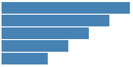

# 第五章 做一个简单的图表

柱形图是一种最简单的可视化图标，主要有矩形、文字标签、坐标轴组成。本文为简单起见，只绘制矩形的部分，用以讲解如何使用 D3 在 SVG 画布中绘图。



## 画布是什么

前几章的处理对象都是 HTML 的文字，没有涉及图形的制作。

要绘图，首要需要的是一块绘图的“**画布**”。

HTML 5 提供两种强有力的“画布”：**SVG** 和 **Canvas**。

### SVG 是什么

SVG，指可缩放矢量图形（Scalable Vector Graphics），是用于描述二维矢量图形的一种图形格式，是由万维网联盟制定的开放标准。
SVG 使用 XML 格式来定义图形，除了 IE8 之前的版本外，绝大部分浏览器都支持 SVG，可将 SVG 文本直接嵌入 HTML 中显示。

SVG 有如下特点：

- SVG 绘制的是矢量图，因此对图像进行放大不会失真。
- 基于 XML，可以为每个元素添加 JavaScript 事件处理器。
- 每个图形均视为对象，更改对象的属性，图形也会改变。
- 不适合游戏应用。

### Canvas 是什么

Canvas 是通过 JavaScript 来绘制 2D 图形，是 HTML 5 中新增的元素。

Canvas 有如下特点：

- 绘制的是位图，图像放大后会失真。
- 不支持事件处理器。
- 能够以 .png 或 .jpg 格式保存图像
- 适合游戏应用

## 添加画布

D3 虽然没有明文规定一定要在 SVG 中绘图，但是 D3 提供了众多的 SVG 图形的生成器，它们都是只支持 SVG 的。因此，建议使用 SVG 画布。

使用 D3 在 body 元素中添加 svg 的代码如下。

```javascript
var width = 300;  //画布的宽度
var height = 300;   //画布的高度

var svg = d3.select("body")     //选择文档中的body元素
    .append("svg")          //添加一个svg元素
    .attr("width", width)       //设定宽度
    .attr("height", height);    //设定高度
```

有了画布，接下来就可以在画布上作图了。

## 绘制矩形

本文绘制一个横向的柱形图。只绘制矩形，不绘制文字和坐标轴。

在 SVG 中，矩形的元素标签是 rect。例如：

```xml
<svg>
<rect></rect>
<rect></rect>
</svg>
```

上面的 rect 里没有矩形的属性。矩形的属性，常用的有四个：

- x：矩形左上角的 x 坐标
- y：矩形左上角的 y 坐标
- width：矩形的宽度
- height：矩形的高度

要注意，在 SVG 中，x 轴的正方向是水平向右，y 轴的正方向是垂直向下的。

现在给出一组数据，要对此进行可视化。数据如下：

```javascript
var dataset = [ 250 , 210 , 170 , 130 , 90 ];  //数据（表示矩形的宽度）
```

为简单起见，我们直接用数值的大小来表示矩形的像素宽度（后面会说到这不是一种好方法）。然后，添加以下代码。

```javascript
var rectHeight = 25;   //每个矩形所占的像素高度(包括空白)

svg.selectAll("rect")
    .data(dataset)
    .enter()
    .append("rect")
    .attr("x",20)
    .attr("y",function(d,i){
         return i * rectHeight;
    })
    .attr("width",function(d){
         return d;
    })
    .attr("height",rectHeight-2)
    .attr("fill","steelblue");
```

这段代码添加了与 dataset 数组的长度相同数量的矩形，所使用的语句是：

```javascript
svg.selectAll("rect")   //选择svg内所有的矩形
    .data(dataset)  //绑定数组
    .enter()        //指定选择集的enter部分
    .append("rect") //添加足够数量的矩形元素
```

这段代码以后会常常出现在 D3 的代码中，请务必牢记。目前不深入讨论它的作用机制是怎样的，只需要读者牢记，当：

**有数据，而没有足够图形元素的时候，使用此方法可以添加足够的元素。**

添加了元素之后，就需要分别给各元素的属性赋值。在这里用到了 function(d, i)，前面已经讲过，d 代表与当前元素绑定的数据，i 代表索引号。给属性赋值的时候，是需要用到被绑定的数据，以及索引号的。

最后一行的：

```javascript
.attr("fill","steelblue");
```

是给矩形元素设置颜色。一般来说，最好写成外置 CSS 的形式，方便归类和修改。这里为了便于初学者理解，将样式直接写到元素里。

结果图如本文开头的图片所示。

## 源代码

下载地址：[rm30.zip](http://www.ourd3js.com/src/rm/rm30.zip)

展示地址：[http://www.ourd3js.com/demo/rm/R-3.0/MakeChart.html](http://www.ourd3js.com/demo/rm/R-3.0/MakeChart.html)


