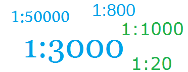

# 第六章 比例尺的使用

比例尺是 D3 中很重要的一个概念，上一章里曾经提到过直接用数值的大小来代表像素不是一种好方法，本章正是要解决此问题。



## 为什么需要比例尺

上一章制作了一个柱形图，当时有一个数组：

```javascript
var dataset = [ 250 , 210 , 170 , 130 , 90 ];
```

绘图时，直接使用 250 给矩形的宽度赋值，即矩形的宽度就是 250 个像素。

此方式非常具有局限性，如果数值过大或过小，例如：

```javascript
var dataset_1 = [ 2.5 , 2.1 , 1.7 , 1.3 , 0.9 ];
var dataset_2 = [ 2500, 2100, 1700, 1300, 900 ];
```

对以上两个数组，绝不可能用 2.5 个像素来代表矩形的宽度，那样根本看不见；也不可能用 2500 个像素来代表矩形的宽度，因为画布没有那么长。

于是，我们需要一种计算关系，能够：

**将某一区域的值映射到另一区域，其大小关系不变。**

这就是比例尺（Scale）。

## 有哪些比例尺

比例尺，很像数学中的函数。例如，对于一个一元二次函数，有 x 和 y 两个未知数，当 x 的值确定时，y 的值也就确定了。

在数学中，x 的范围被称为**定义域**，y 的范围被称为**值域**。

D3 中的比例尺，也有定义域和值域，分别被称为 domain 和 range。开发者需要指定 domain 和 range 的范围，如此即可得到一个计算关系。

D3 提供了多种比例尺，下面介绍最常用的两种。

### 线性比例尺

线性比例尺，能将一个连续的区间，映射到另一区间。要解决柱形图宽度的问题，就需要线性比例尺。

假设有以下数组：

```javascript
var dataset = [1.2, 2.3, 0.9, 1.5, 3.3];
```

现有要求如下：

**将 dataset 中最小的值，映射成 0；将最大的值，映射成 300。**

代码如下：

```javascript
var min = d3.min(dataset);
var max = d3.max(dataset);

var linear = d3.scale.linear()
        .domain([min, max])
        .range([0, 300]);

linear(0.9);    //返回 0
linear(2.3);    //返回 175
linear(3.3);    //返回 300
```

其中，**d3.scale.linear()** 返回一个线性比例尺。domain() 和 range() 分别设定比例尺的定义域和值域。在这里还用到了两个函数，它们经常与比例尺一起出现：

- d3.max()
- d3.min()

这两个函数能够求数组的最大值和最小值，是 D3 提供的。按照以上代码，

比例尺的定义域 domain 为：[0.9, 3.3]

比例尺的值域 range 为：[0, 300]

因此，当输入 0.9 时，返回 0；当输入 3.3 时，返回 300。当输入 2.3 时呢？返回 175，这是按照线性函数的规则计算的。

有一点请大家记住：

d3.scale.linear() 的返回值，是可以当做**函数**来使用的。因此，才有这样的用法：linear(0.9)。

### 序数比例尺

有时候，定义域和值域不一定是连续的。例如，有两个数组：

```javascript
var index = [0, 1, 2, 3, 4];
var color = ["red", "blue", "green", "yellow", "black"];
```

我们希望 0 对应颜色 red，1 对应 blue，依次类推。

但是，这些值都是离散的，线性比例尺不适合，需要用到序数比例尺。

```javascript
var ordinal = d3.scale.ordinal()
        .domain(index)
        .range(color);

ordinal(0); //返回 red
ordinal(2); //返回 green
ordinal(4); //返回 black
```

用法与线性比例尺是类似的。

## 给柱形图添加比例尺

在上一章的基础上，修改一下数组，再定义一个线性比例尺。

```javascript
var dataset = [ 2.5 , 2.1 , 1.7 , 1.3 , 0.9 ];

var linear = d3.scale.linear()
        .domain([0, d3.max(dataset)])
        .range([0, 250]);
```

其后，按照上一章的方法添加矩形，在给矩形设置宽度的时候，应用比例尺。

```javascript
var rectHeight = 25;   //每个矩形所占的像素高度(包括空白)

svg.selectAll("rect")
    .data(dataset)
    .enter()
    .append("rect")
    .attr("x",20)
    .attr("y",function(d,i){
         return i * rectHeight;
    })
    .attr("width",function(d){
         return linear(d);   //在这里用比例尺
    })
    .attr("height",rectHeight-2)
    .attr("fill","steelblue");
```

如此一来，所有的数值，都按照同一个线性比例尺的关系来计算宽度，因此数值之间的大小关系不变。

## 源代码

下载地址：[rm40.zip](http://www.ourd3js.com/src/rm/rm40.zip)

展示地址：[http://www.ourd3js.com/demo/rm/R-4.0/UseScaleInChart.html](http://www.ourd3js.com/demo/rm/R-4.0/UseScaleInChart.html)


