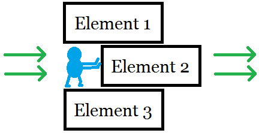
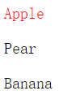
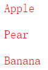
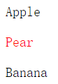
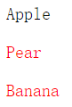

# 第三章 选择元素和绑定数据

本章介绍在 D3 中选择、插入、删除元素的方法。



## 如何选择元素

上一章已经讲解了 select 和 selectAll，以及选择集的概念。本节具体讲解这两个函数的用法。

假设在 body 中有三个段落元素：

```html
<p>Apple</p>
<p>Pear</p>
<p>Banana</p>
```

现在，要分别完成以下四种选择元素的任务。

### 选择第一个 p 元素

使用 select ，参数传入 p 即可，如此返回的是第一个 p 元素。

```javascript
t("p");
p1.style("color","red");
```

结果如下图，被选择的元素标记为红色。



### 选择三个 p 元素

使用 selectAll 选择 body 中所有的 p 元素。

```javascript
var p = body.selectAll("p");
p.style("color","red");
```

结果如下：



### 选择第二个 p 元素

有不少方法，一种比较简单的是给第二个元素添加一个 id 号。

<p id="myid">Pear</p>

然后，使用 select 选择元素，注意参数中 id 名称前要加 # 号。

```javascript
var p2 = body.select("#myid");
p2.style("color","red");
```

结果如下：



### 选择后两个 p 元素

给后两个元素添加 class，

```html
<p class="myclass">Pear</p>
<p class="myclass">Banana</p>
```

由于需要选择多个元素，要用 selectAll。注意参数，class 名称前要加一个点。

```javascript
var p = body.selectAll(".myclass");
p.style("color","red");
```

结果如下：



关于 select 和 selectAll 的参数，其实是符合 CSS 选择器的条件的，即用“井号（#）”表示 id，用“点（.）”表示 class。

此外，对于已经绑定了数据的选择集，还有一种选择元素的方法，那就是灵活运用 function(d, i)。我们已经知道参数 i 是代表索引号的，于是便可以用条件判定语句来指定执行的元素。

## 插入元素

插入元素涉及的函数有两个：

- append()：在选择集末尾插入元素
- insert()：在选择集前面插入元素

假设有三个段落元素，与上文相同。

### append()

```javascript
body.append("p")
    .text("append p element");
```

在 body 的末尾添加一个 p 元素，结果为：

```javascript
Apple
Pear
Banana
append p element
```

### insert()

在 body 中 id 为 myid 的元素前添加一个段落元素。

```javascript
body.insert("p","#myid")
  .text("insert p element");
```

已经指定了 Pear 段落的 id 为 myid，因此结果如下。

```javascript
Apple
insert p element
Pear
Banana
```

## 删除元素

删除一个元素时，对于选择的元素，使用 remove 即可，例如：

```javascript
var p = body.select("#myid");
p.remove();
```

如此即可删除指定 id 的段落元素。
