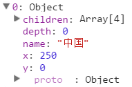
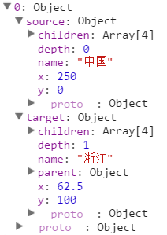

# 第十五章 树状图

树状图，可表示节点之间的包含与被包含关系。

## 数据

初始数据先写在一个 JSON 文件中，再用 D3 来读取。

JSON(JavaScript Object Notation) 是一种轻量级的数据交换格式。关于此格式的简介和语法规则，可分别参见两篇文章：[JSON 简介](http://www.ourd3js.com/wordpress/?p=1852)和[JSON 语法规则](http://www.ourd3js.com/wordpress/?p=1874)。

现有数据如下：

```javascript
{
"name":"中国",
"children":
[
    { 
      "name":"浙江" , 
      "children":
      [
            {"name":"杭州" },
            {"name":"宁波" },
            {"name":"温州" },
            {"name":"绍兴" }
      ] 
    },
    
    { 
        "name":"广西" , 
        "children":
        [
            {
            "name":"桂林",
            "children":
            [
                {"name":"秀峰区"},
                {"name":"叠彩区"},
                {"name":"象山区"},
                {"name":"七星区"}
            ]
            },
            {"name":"南宁"},
            {"name":"柳州"},
            {"name":"防城港"}
        ] 
    },
    
    { 
        "name":"黑龙江",
        "children":
        [
            {"name":"哈尔滨"},
            {"name":"齐齐哈尔"},
            {"name":"牡丹江"},
            {"name":"大庆"}
        ] 
    },
    
    { 
        "name":"新疆" , 
        "children":
        [
            {"name":"乌鲁木齐"},
            {"name":"克拉玛依"},
            {"name":"吐鲁番"},
            {"name":"哈密"}
        ]
    }
]
}
```

这段数据表示：“中国 – 省份名 – 城市名”的包含于被包含关系。

## 布局（数据转换）

定义一个集群图布局：

```javascript
var tree = d3.layout.tree()
  .size([width, height-200])
  .separation(function(a, b) { return (a.parent == b.parent ? 1 : 2); });
```

布局保存在变量 tree 中。

size()：设定尺寸，即转换后的各节点的坐标在哪一个范围内。

separation()：设定节点之间的间隔。

接下来，转换数据：

```javascript
d3.json("city_tree.json", function(error, root) {

  var nodes = tree.nodes(root);
  var links = tree.links(nodes);
  
  console.log(nodes);
  console.log(links);

}
```

d3.json() 是用来向服务器请求 JSON 文件的。

要注意，d3.json() 不能读取本地文件。例如，将 html 文件与 json 文件放到本地同一目录，打开 html 文件是不能顺利读取的。需要搭建一个网络服务器来使用它，可用 Apache 搭建一个简单的服务器（参见【[搭建 Apache](http://www.ourd3js.com/wordpress/?p=413)】）。否则，浏览器（Chrome）的控制台中，会出现以下错误：

**XMLHttpRequest cannot load file:///D:/*******/city.json. Cross origin requests are only supported for HTTP. **

经过测试，Firefox 可以直接读取本地文件，无需搭服务器，其他大多数浏览器不行。建议搭建服务器进行测试，这是正确的做法。

d3.json() 函数后面跟一个无名函数 function(error) ，参数 root 是读入的数据。

后两行代码调用 tree 转换数据，保存到变量 nodes 和 links 中。然后输出转换后的数据，结果如下图所示：

转换后的节点数据（nodes）：



转换后的连线数据（links）：



nodes 中有各个节点的子节点（children）、深度（depth）、名称（name）、位置（x，y）信息，其中名称（name）是 json 文件中就有的属性。

links 中有连线两端（ source , target ）的节点信息。

## 绘制

D3 已经基本上为我们准备好了绘制的函数：d3.svg.diagonal() 。这是一个对角线生成器，只需要输入两个顶点坐标，即可生成一条贝塞尔曲线。

创建一个对角线生成器：

```javascript
var diagonal = d3.svg.diagonal()
    .projection(function(d) { return [d.y, d.x]; });
```

projection() 是一个点变换器，默认是 [ d.x , d.y ]，即保持原坐标不变，如果写成 [ d.y , d.x ] ，即是说对任意输入的顶点，都交换 x 和 y 坐标。

绘制连线时，使用方法如下：

```javascript
var link = svg.selectAll(".link")
      .data(links)
      .enter()
      .append("path")
      .attr("class", "link")
      .attr("d", diagonal);   //使用对角线生成器
```

绘制节点时，还是用 <svg> 中的 <circle> 来绘制，这里就不复述了，前面已经使用过。结果图为：


## 源代码

下载地址：[rm95.zip](http://www.ourd3js.com/src/rm/rm95.zip)

展示地址：[http://www.ourd3js.com/demo/rm/R-9.5/tree.html](http://www.ourd3js.com/demo/rm/R-9.5/tree.html)
